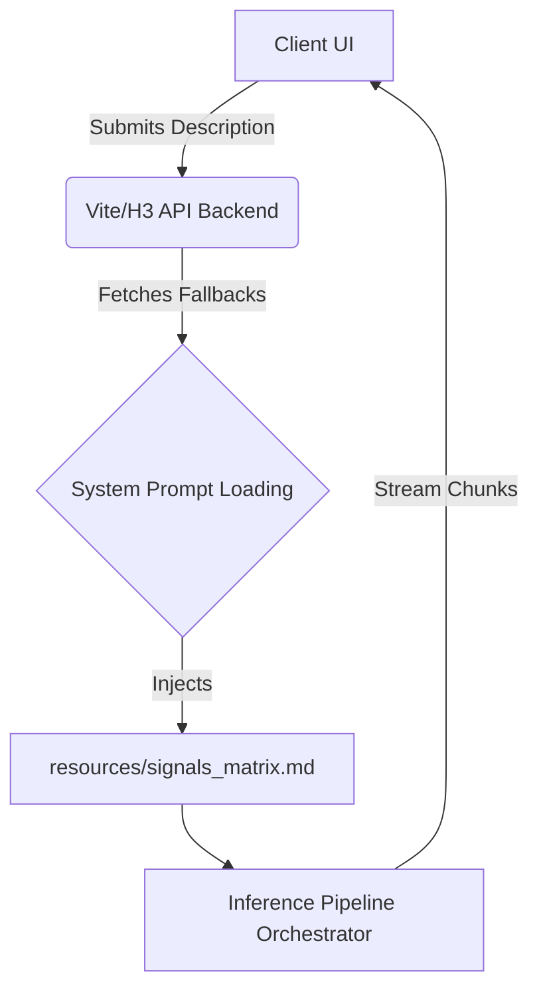

# EU AI Act Compliance Engine (Air Control)

Air Control is a sophisticated compliance and risk classification engine designed to evaluate products and systems against the European Union AI Act. Using Gemini as the core inference engine, the application takes a plain-text product description and rigorously processes it through a multi-stage pipeline, resulting in a structured compliance assessment, risk mappings, and a detailed markdown/HTML report.

The engine features both a modern React/Vite-powered web interface with real-time streaming, and a robust batch-processing script for evaluating massive datasets over Arize Phoenix.

---

## 1. Features Overview

- **Multi-Stage Inference Pipeline**: Breaks down complex legal classification into sequential AI tasks:
  1. `SIGNALS`: Extracts core architectural and operational signals into a structured matrix.
  2. `CLASSIFICATION`: Determines the Primary Risk (Unacceptable, High, Limited, Minimal) and Primary Role (Provider, Deployer, Distributor, Importer).
  3. `MAP`: Maps the system against specific articles in the AI Act (e.g. Annex III).
  4. `WARNINGS`: Identifies potential risk transformations (e.g. system combinations or upstream dependencies).
  5. `INFO`: Highlights key informational obligations.
- **Streaming Web Interface**: Real-time evaluation streaming with TanStack Router, React, and Radix UI components.
- **LLM Runaway Protection**: Enforces strict output format constraints and hard token limits (`max_tokens: 7000`), with client-side abort capabilities.
- **Batch Evaluation & Instrumentation**: Built-in support for processing CSV batches with full OpenTelemetry (OTel) tracing to Arize Phoenix.
- **Report Generation**: Dynamically compiles compliance outcomes into styled Markdown and HTML documents.

---

## 2. Installation & Quick Start

### Prerequisites
- Node.js (v18 or higher recommended)
- Python 3.10+ (for fetching Phoenix prompts during batch testing)
- A valid Google Gemini API Key

### Setup
1. Clone the repository and install the dependencies:
   ```bash
   npm install
   ```

2. Setup your environment variables. You must expose your Gemini API key to the terminal session or place it in a `.env` file:
   ```bash
   export GEMINI_API_KEY="your-api-key-here"
   ```

3. Start the development server:
   ```bash
   npm run dev
   ```

4. The web application will now be available locally (typically on `http://localhost:5173`).

### Running Batch Evaluations
If you want to run the pipeline across a dataset (CSV) without the UI:
```bash
npx tsx scripts/batch_runner.ts <path-to-csv> [--stage=SIGNALS] [--test-quantity=10]
```

---

## 3. Configuration & Fallbacks

The engine relies on a strict configuration of system prompts and evaluation resources to prevent hallucination. 

### API Keys
- `GEMINI_API_KEY`: Required globally. The backend uses the OpenAI SDK compat wrapper pointing to `generativelanguage.googleapis.com` to communicate with Gemini.

### File Resources
The AI engine relies heavily on dynamic injection of context files located in the `resources/` directory:
- `resources/signals_matrix.md`: Contains the authoritative matrix for extracting compliance signals. **This is dynamically injected into the system prompt at runtime.**
- `resources/eval/prompt_history.jsonl`: Logs the exact system prompts and rules used for each batch session.

### System Prompt Fallbacks
The system uses a strict hierarchy to determine its persona:
1. **Web App**: Uses the `DEFAULT_SYSTEM_PROMPT` (defined in `src/lib/classifier/templates.ts`) combined with the `signals_matrix.md`.
2. **Batch Runner**: First attempts to fetch the live prompt `eu-ai-act-classifier-system-prompt` directly from Arize Phoenix using `fetch_prompt.py`. 
   - *Fallback 1*: Reads from `resources/prompts/eu-ai-act-classifier-system-prompt.md`.
   - *Fallback 2*: Drops back to `DEFAULT_SYSTEM_PROMPT`.

---

## 4. Architectural Overview

### System Architecture & Application Flow

The app leverages a modern full-stack Vite setup. The client triggers the evaluation via the `api/classify` streaming endpoint or the `api/v1/compliance/evaluate` REST endpoint.



### Inference Pipeline (AI Touchpoints)

The core compliance logic uses a sequential chain of thought where the output of one stage is injected into the context of the next.

```mermaid
sequenceDiagram
    participant User
    participant App
    participant Gemini as Gemini 3.5 Flash

    User->>App: Submits Product Description
    
    rect rgb(30, 30, 30)
    Note over App,Gemini: Stage 1: Signals
    App->>Gemini: System Prompt + Matrix + Description
    Gemini-->>App: 4-Column Signals Table
    end

    rect rgb(30, 30, 30)
    Note over App,Gemini: Stage 2: Classification
    App->>Gemini: System Prompt + Description + Signals Table
    Gemini-->>App: Risk & Role Classification
    end

    rect rgb(30, 30, 30)
    Note over App,Gemini: Stage 3-5: Details
    App->>Gemini: Request Mappings, Warnings, Info
    Gemini-->>App: Bulleted Lists (Obligations & Links)
    end

    App->>User: Compiles & Renders Markdown/HTML Report
```



### Safety Controls
To prevent runaway hallucinations, the backend intercepts all LLM requests with the following constraints:
- **Strict Formatting Instructions**: e.g., `Respond ONLY with exactly... PRIMARY_RISK: ...`.
- **`max_tokens: 7000`**: Hard limits output generation to prevent infinite loops.
- **Client Disconnect Hooks**: Aborts the upstream generation request to Gemini if the user closes the browser tab.
